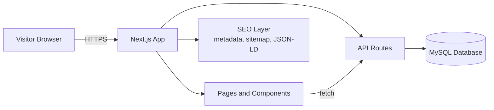

<div align="center">


<a href="https://mahatabpropertieslimited.com">
  
</a>

<br/>

[](https://mahatabpropertieslimited.com)
[](https://nextjs.org)
[](https://www.mysql.com)
[](https://nodejs.org)
[](#-seo-strategy)

**[Explore the Website](https://mahatabpropertieslimited.com)** · **[Features](#-features)** · **[Quick Start](#-quick-start)** · **[API](#-api-reference)** · **[Deployment](#-deployment-on-cpanel)**

</div>

---

## About

> *"A home is not just a building. It is where life happens."*

**Mahatab Properties Limited** is a real estate company, and this repository holds its official website. The site lets visitors browse properties, view details, and enquire in a few clicks. It is built for speed, search visibility and a smooth, modern feel.

<table>
<tr>
<td align="center"><h3>Fast</h3>Server-rendered pages<br/>and optimised assets</td>
<td align="center"><h3>Searchable</h3>Structured data, clean URLs<br/>and complete metadata</td>
<td align="center"><h3>Animated</h3>Scroll-triggered motion<br/>and micro-interactions</td>
<td align="center"><h3>Data-driven</h3>MySQL and REST APIs<br/>behind every listing</td>
</tr>
</table>

---

## Features

| | Feature | Description |
|---|---|---|
| 🏠 | **Property listings** | Dynamic listings loaded from MySQL through API routes |
| 🔎 | **Search and filters** | Filter by type, location, price range and status |
| 🖼️ | **Rich galleries** | Optimised images with lazy loading and smooth transitions |
| ✨ | **Interactive animations** | Scroll reveals, hover effects, animated counters and page transitions |
| 📩 | **Enquiry forms** | Contact and property enquiry forms with validation, stored in the database |
| 📱 | **Fully responsive** | Designed mobile-first for phones, tablets and desktops |
| 🌗 | **Clean typography** | A consistent type scale for headings, body and captions |
| 🚀 | **SEO-first** | Metadata, sitemap, robots, Open Graph and JSON-LD on every page |

---

## Tech Stack

<div align="center">

| Layer | Technology |
|---|---|
| **Framework** | Next.js 14.2.5 (React) |
| **Language** | TypeScript / JavaScript |
| **Database** | MySQL |
| **API** | Next.js API routes (REST) |
| **Styling** | CSS / Tailwind CSS *(edit to match your setup)* |
| **Animation** | CSS transitions and scroll-based animation *(add your library, e.g. Framer Motion)* |
| **Hosting** | cPanel Node.js hosting |

</div>

---

## Architecture



---

## Quick Start

### Prerequisites

- Node.js **18+** (production runs on Node 22)
- A running **MySQL** server
- npm, yarn or pnpm

### 1. Clone

```bash
git clone https://github.com/<your-username>/mpl-web.git
cd mpl-web
```

### 2. Install

```bash
npm install
```

### 3. Configure environment

Create a `.env.local` file in the project root:

```env
# Database
DB_HOST=localhost
DB_PORT=3306
DB_USER=your_mysql_user
DB_PASSWORD=your_mysql_password
DB_NAME=your_database_name

# Site
NEXT_PUBLIC_SITE_URL=https://mahatabpropertieslimited.com
```

> Never commit `.env.local` to Git.

### 4. Run in development

```bash
npm run dev
```

Open <http://localhost:3000>.

### 5. Build for production

```bash
npm run build
npm start
```

---

## Project Structure

```text
mpl-web/
├── app/ or pages/        # Routes, layouts and API routes
│   └── api/              # REST endpoints (properties, enquiries, ...)
├── components/           # Reusable UI and animated components
├── lib/
│   └── db.(ts|js)        # MySQL connection and query helpers
├── public/               # Static assets, images, favicon, robots.txt
├── styles/               # Global styles and typography
├── next.config.js
├── package.json
└── README.md
```

*Adjust this tree to match your actual folders.*

---

## API Reference

<details>
<summary><b>Click to expand the endpoints</b></summary>

<br/>

| Method | Endpoint | Purpose |
|---|---|---|
| `GET` | `/api/properties` | List properties, with optional filters |
| `GET` | `/api/properties/[id]` | Fetch one property with full details |
| `POST` | `/api/enquiry` | Submit a contact or property enquiry |

**Example request**

```bash
curl "https://mahatabpropertieslimited.com/api/properties?type=apartment&location=dhaka"
```

**Example response**

```json
{
  "success": true,
  "data": [
    {
      "id": 1,
      "title": "Modern 3-Bedroom Apartment",
      "type": "apartment",
      "location": "Dhaka",
      "price": 12500000,
      "status": "available"
    }
  ]
}
```

*Replace the endpoints above with your real routes.*

</details>

---

## Animations and Interactions

<details>
<summary><b>What moves and why</b></summary>

<br/>

- **Scroll reveal:** sections fade and slide in as they enter the viewport
- **Hover effects:** property cards lift and images zoom slightly
- **Animated counters:** numbers such as projects and happy clients count up
- **Page transitions:** smooth movement between routes
- **Micro-interactions:** buttons, inputs and menus give clear feedback

**Performance rules used**

- Animate `transform` and `opacity` only, so the browser can use the GPU
- Respect `prefers-reduced-motion` for accessibility
- Lazy-load anything below the fold

</details>

---

## SEO Strategy

Good rankings come from many things working together. This project covers the technical side:

- [x] Unique `<title>` and meta description on every page
- [x] Canonical URLs to avoid duplicate content
- [x] Open Graph and Twitter Card tags for link previews
- [x] JSON-LD structured data (`RealEstateAgent`, `Product` or `Offer` for listings)
- [x] `sitemap.xml` and `robots.txt`
- [x] Semantic HTML with a single `<h1>` per page and a logical heading order
- [x] Optimised images with `next/image`, sizes and alt text
- [x] Clean, readable URLs (for example `/properties/modern-3-bedroom-apartment`)
- [x] Server-side rendering or static generation for crawlable content
- [x] Good Core Web Vitals (LCP, CLS, INP)
- [x] Mobile-friendly, HTTPS-only

> Technical SEO makes ranking possible. Position also depends on content quality, backlinks, local listings (Google Business Profile) and competition. Track progress in **Google Search Console**.

---

## Deployment on cPanel

<details>
<summary><b>Step-by-step</b></summary>

<br/>

1. Upload the project to your app root (for example `~/mahatabproperties`).
2. In cPanel, open **Setup Node.js App**, choose your Node version and set the startup file (for example `app.js`).
3. Add the environment variables from the section above.
4. Run **NPM Install**, then build:

   ```bash
   npm run build
   ```

5. **Restart** the application from cPanel.
6. Confirm the site loads over HTTPS and that database connections work.

</details>

---

## Scripts

| Command | What it does |
|---|---|
| `npm run dev` | Start the development server |
| `npm run build` | Create the production build |
| `npm start` | Run the production server |
| `npm run lint` | Check code style |

---

## Contributing

1. Fork the repository
2. Create a branch: `git checkout -b feature/your-feature`
3. Commit: `git commit -m "Add your feature"`
4. Push: `git push origin feature/your-feature`
5. Open a Pull Request

---

## License

Copyright © Mahatab Properties Limited. All rights reserved.
*(Change this if you choose an open-source licence.)*

---

<div align="center">

### Contact

**Mahatab Properties Limited**
[mahatabpropertieslimited.com](https://mahatabpropertieslimited.com)


</div>
